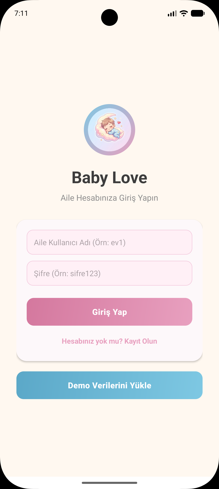
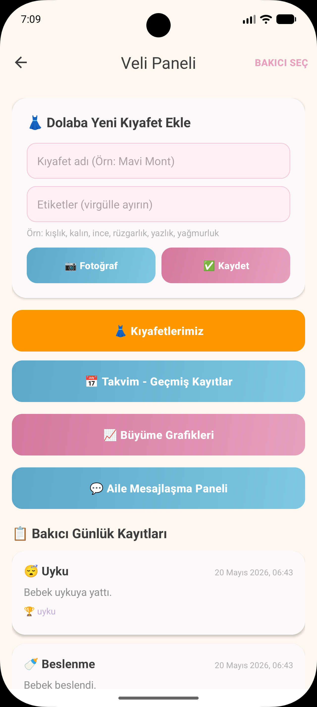
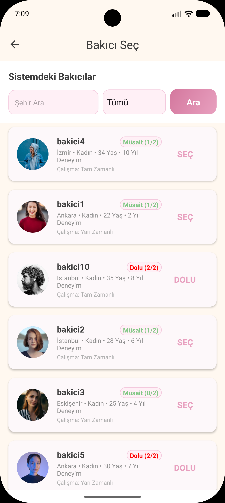
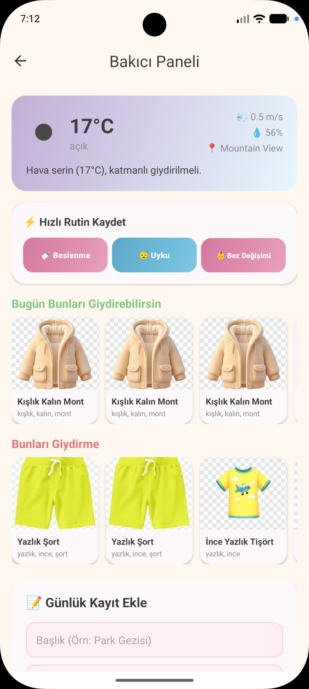
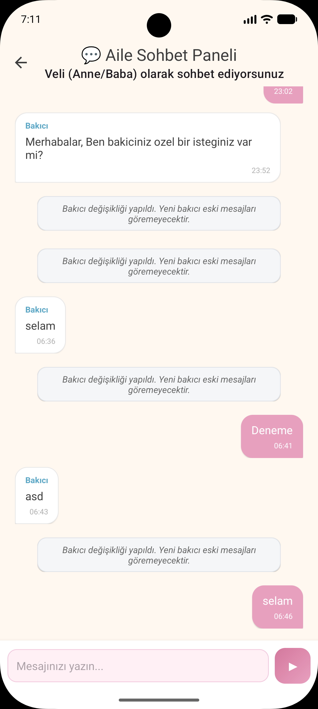
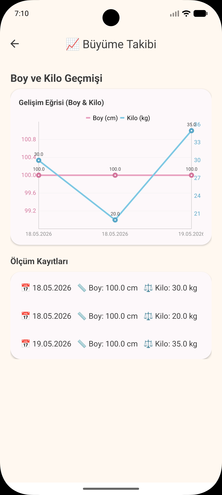

# Baby Love - Akıllı Bebek Takip ve Bakıcı Koordinasyon Uygulaması

<p align="center">
  
</p>

<p align="center">
  <b>Veliler ve bakıcılar arasındaki koordinasyonu dijitalleştiren, akıllı hava durumu algoritmaları ve yüksek gizlilik önlemleriyle donatılmış modern bir Android uygulaması.</b>
</p>

---

## 📸 Ekran Görüntüleri

<table align="center">
  <tr>
    <td align="center"><b>Giriş Ekranı</b></td>
    <td align="center"><b>Veli Paneli</b></td>
    <td align="center"><b>Bakıcı Arama & Seçim</b></td>
  </tr>
  <tr>
    <td></td>
    <td></td>
    <td></td>
  </tr>
  <tr>
    <td align="center"><b>Bakıcı Paneli & Hava Durumu</b></td>
    <td align="center"><b>Sohbet Ekranı</b></td>
    <td align="center"><b>Gelişim Grafikleri</b></td>
  </tr>
  <tr>
    <td></td>
    <td></td>
    <td></td>
  </tr>
</table>

---

## 📱 Proje Hakkında

**Baby Love**, bebeklerin günlük bakım rutinlerinin (uyku, beslenme, bez değişimi, sağlık vb.) kolayca takip edilmesini sağlarken, veliler ile bakıcıların anlık iletişim kurabilmesine olanak tanır. Uygulama, sıradan bebek takip uygulamalarından farklı olarak **akıllı karar destek mekanizmaları** ve **veri gizliliği algoritmaları** barındırır.

### Öne Çıkan Özellikler

*   **🌤️ Hava Durumu Destekli Akıllı Kıyafet Önerisi:** Cihazın GPS sensöründen veya seçilen şehirden alınan anlık hava durumuna göre, veritabanındaki bebek gardırobunu tarayarak o gün giydirilmesi ve giydirilmemesi gereken kıyafet kombinlerini önerir.
*   **🔒 Bakıcı Değişiminde Sohbet Gizliliği (KVKK Uyumlu):** Veli bakıcıyı çıkardığı anda, geçmiş sohbet verileri yeni atanacak bakıcıdan gizlenir. Araya otomatik bir sistem bildirimi eklenir ve veli geçmiş konuşmaları görebilirken, yeni bakıcı sohbet ekranına tertemiz bir başlangıç yapar.
*   **⚡ Canlı Sistemden Düşürme (Real-time Kick):** Veli, bakıcıyla olan atama ilişkisini kestiği anda bakıcının ekranında (sohbette veya ana panelde olsa dahi) anında *"Bu aile ile olan ilişkiniz sonlandırılmıştır"* uyarısı belirir ve oturumu sonlandırılarak panelden atılır.
*   **📊 Büyüme Grafikleri & Takvim:** Bebeğin boy ve kilo gelişim süreçleri çizgi grafiklerle görselleştirilir. Takvim ekranından geçmişe dönük tüm kayıtlar gün gün listelenebilir.
*   **🧸 Gelişim Kilometre Taşları (Milestones):** Bebeğin "İlk Adım 🚶", "İlk Kelime 🗣️", "Aşı 💉" gibi önemli anları fotoğraflı ve kazanım etiketleriyle kayıt altına alınabilir.
*   **📸 Ücretsiz Yerel Depolama (Internal Storage):** Görselleri Firebase Storage yerine cihazın kendi iç hafızasında barındırarak Firebase'in ek ücretlendirme limitlerini aşar ve yüksek performansla anında yükleme sağlar.

---

## 🛠️ Kullanılan Teknolojiler

*   **Geliştirme Dili:** Java (Android SDK)
*   **Tasarım Mimarisi:** Android Material Design (XML Layouts)
*   **Veritabanı (BaaS):** Google Firebase Firestore (NoSQL Real-time Database)
*   **Ağ / REST API:** Retrofit 2 & GSON Converter
*   **Görsel İşleme:** Glide (Image Caching & Loading)
*   **Donanım & Konum:** Google Play Services Location (GPS)
*   **Veri Yönetimi:** SharedPreferences (Oturum ve kullanıcı ayarları yönetimi)

---

## 📂 Proje Yapısı (Project Structure)

Uygulamanın kaynak kodları, modülerlik ve sürdürülebilirlik ilkelerine uygun olarak şu şekilde düzenlenmiştir:

```text
com.example.babylove
│
├── 📂 models             # Veri Modelleri (Java Beans)
│   ├── User.java         # Kullanıcı (Veli/Bakıcı) modeli, profil bilgileri
│   ├── Message.java      # Mesajlaşma modeli (visibleToBakici ve tip kontrolü içerir)
│   ├── LogEntry.java     # Bebek günlük rutinleri, boy/kilo ve kazanım verileri
│   ├── WardrobeItem.java # Bebek gardırop kıyafet veri yapısı
│   └── MilestoneTags.java# Gelişim etiketleri ve renk eşleştirmeleri
│
├── 📂 network            # İnternet & REST API Katmanı
│   ├── WeatherApiService.java # Retrofit API tanımları (OpenWeatherMap)
│   └── WeatherResponse.java   # API'den dönen hava durumu JSON modeli
│
├── 📂 adapters           # RecyclerView Arayüz Bağlayıcıları
│   ├── ChatAdapter.java       # Veli, Bakıcı ve Sistem mesajlarını farklı tasarımlarla listeler
│   ├── LogEntryAdapter.java   # Bebek günlük loglarını listeler
│   ├── WardrobeAdapter.java   # Gardırop kıyafet listesini yönetir
│   └── RecommendationAdapter.java # Hava durumuna göre önerilen kıyafetleri yatay listeler
│
├── 📂 utils              # Yardımcı Sınıflar
│   ├── ImageStorageHelper.java # Seçilen resimleri yerel dosya sistemine kopyalar
│   └── WeatherRecommender.java # Sıcaklığa göre kıyafet etiketi öneren algoritma
│
└── 📂 ui                 # Kullanıcı Arayüzü Aktiviteleri (Activities)
    ├── SplashActivity.java     # Oturum kontrollü açılış ekranı
    ├── LoginActivity.java      # Giriş ekranı (Demo Veri Yükleme butonu barındırır)
    ├── RegisterActivity.java   # Kayıt ekranı
    ├── VeliPanelActivity.java  # Veli ana yönetim paneli
    ├── BakiciMainActivity.java # Bakıcının atandığı aileleri listeleme ekranı
    ├── BakiciPanelActivity.java# Bakıcının aktif çalışma alanı (Hava durumu & Rutinler)
    ├── BakiciSecActivity.java  # Bakıcı arama, filtreleme ve bağ koparma ekranı
    ├── ChatActivity.java       # Sohbet ve canlı ilişki kontrol ekranı
    ├── CalendarActivity.java   # Geçmiş kayıt takvimi
    └── GrowthChartActivity.java# Boy/Kilo büyüme grafik ekranı
```

---

## ⚙️ Kurulum ve Çalıştırma

1.  **Projeyi Klonlayın:**
    ```bash
    git clone https://github.com/KULLANICI_ADINIZ/PROJE_ADINIZ.git
    ```
2.  **Android Studio ile Açın:**
    Android Studio'yu açıp `Import Project` seçeneğiyle klonladığınız klasörü seçin. Gradle bağımlılıklarının yüklenmesini bekleyin.
3.  **Firebase Yapılandırması:**
    *   Firebase Console üzerinde yeni bir proje oluşturun.
    *   Projenize Android uygulaması ekleyin (Paket adı: `com.example.babylove`).
    *   `google-services.json` dosyasını indirip `app/` dizini altına yerleştirin.
    *   Firestore veritabanını aktif edin.
4.  **Uygulamayı Çalıştırın:**
    Emülatör veya gerçek bir Android cihaz bağlayarak **Run (Çalıştır)** butonuna basın.

---

## 💡 Kolay Test Etme (Demo Seeding)

Uygulamanın tüm özelliklerini sıfırdan hesap açmadan hızlıca deneyimleyebilmeniz için Giriş Ekranına **"Demo Verilerini Yükle"** butonu eklenmiştir. Bu butona basıldığında arka planda otomatik olarak:
*   **10 Adet Bakıcı** (`bakici1` - `bakici10`, şifreleri `123`) Ankara, İstanbul, İzmir, Eskişehir illerinde kayıt edilir.
*   **10 Adet Veli** (`ev1` - `ev10`, şifreleri `sifre123`) oluşturulur.
*   Velilerin gardırobuna **hava durumuna duyarlı etiketlere sahip 7 adet kıyafet** yüklenir.
*   Sistem, bakıcıları velilere rastgele atar (Hiçbir bakıcıya en fazla 2 aileden fazlası atanmayacak kuralı korunur).
